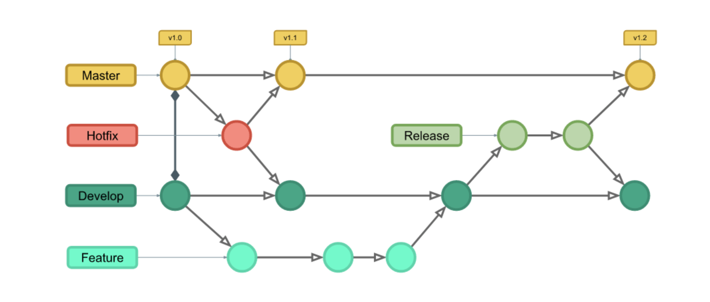

require Node v20
Create .dev.env

yarn

yarn run dev

### Git Flow

- **Naming:**

    - Branch: \<prefix>/action

        1.  Prefix: feature, fix, maintain
        2.  Action: that is short message overview the task (do not contain main, develop)

    - Message: \<action>(\<affect>): \<message> (#\<ticket Id>)
        1.  Action: feat, fix, chore, docs, maintain
        2.  Affect: features, or scope affective
        3.  Example:
            1.  fix(db): remove process from db for cloudflare
            2.  fix(api): change account id to workspace id in api spec (#45)

- **Flow:**
    - Model:
      
    - Feature Branches:
        - Each new feature should reside in its own branch, which can be pushed to the central repository for backup/collaboration. But, instead of branching off of master, feature branches use develop as their parent branch. When a feature is complete, it gets merged back into develop. Features should never interact directly with main.
    - Creating a feature branch
        - `git checkout develop`
        - `git checkout -b feature_branch`
    - Publishing a feature branch
        - 1. Commit:
            - `git add <file-change>`
            - `git commit -m <message>`
        - 2. Review commit:
            - `git rebase -i HEAD~<number>` (Squashing chore commit)
        - 3. Update develop change:
            - `git checkout develop`
            - `git pull origin develop`
            - `git checkout feature_branch`
            - `git rebase -i develop`
        - 4. Pushing to origin:
            - `git push origin feature_branch`
        - 5. Create pull request to develop